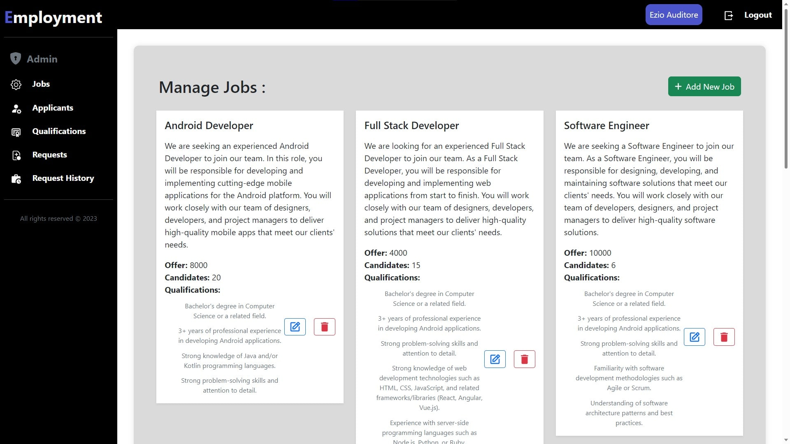
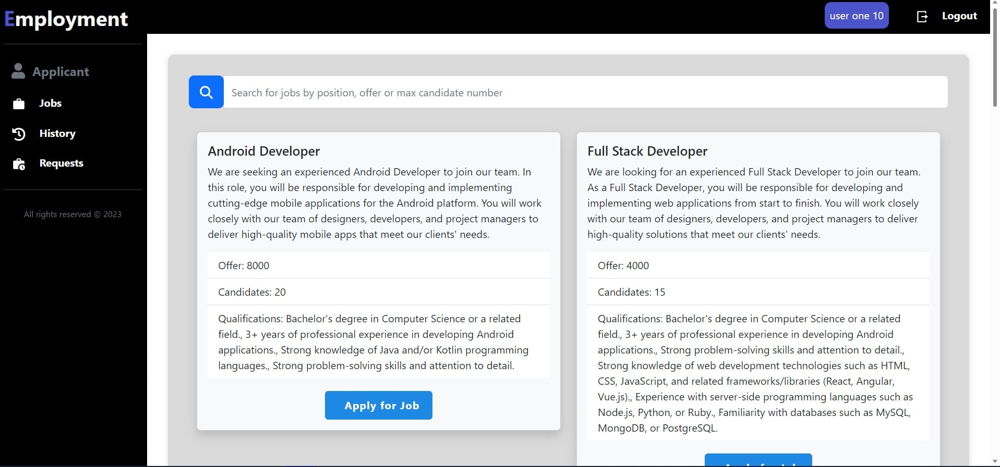
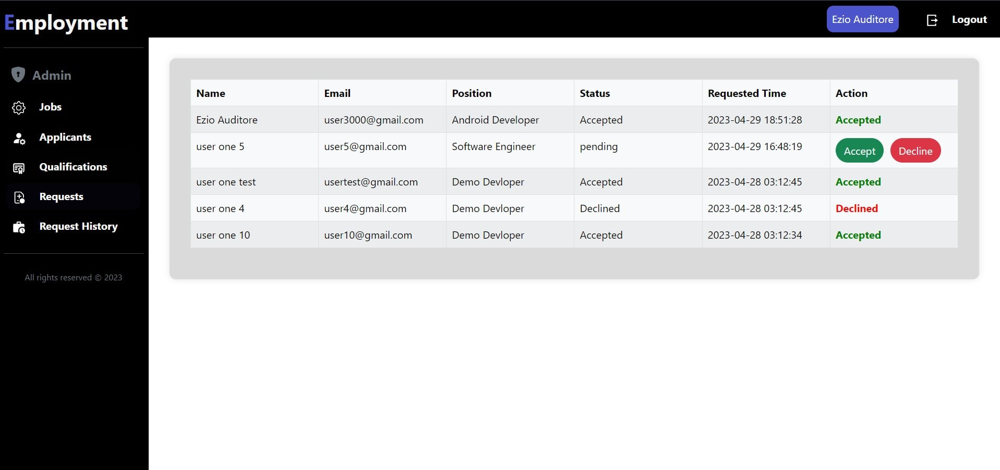

# Employment Dashboard

Employment Dashboard is a web application that helps people find jobs. It consists of two types of users: Admin and Applicant. Admin users can manage jobs, qualifications, and applicants, while Applicant users can view and filter jobs and request jobs from the available listings.

## Features

### Admin User

- Login/Logout: Admin users can log in and out of the application.
- Manage Jobs: Admin users can add, update, delete, and list jobs.
- Manage Qualifications: Admin users can add, update, delete, and list job qualifications.
- Manage Applicants: Admin users can add, update, delete, and list applicants.
- Accept or Decline Requests: Admin users can accept or decline job requests made by applicants.
- Show Request History: Admin users can view the history of job requests for all jobs.

### Applicant User

- Login/Logout: Applicant users can log in and out of the application.
- View and Filter Jobs: Applicant users can view and filter job listings.
- Request Jobs: Applicant users can send job requests to the admin for available listings.
- Show Search History: Applicant users can view the history of job searches related to their account.

## Database Models

- User Model: The User model consists of email, password, phone, status (active, in-active), and type (admin, Applicant).
- Job Model: The Job model consists of position, description, offer, maximum candidate number, and qualifications.
- Qualifications Model: The Qualifications model consists of description.

## Technologies

- Backend: Node.js and Express.js
- Database: MySQL
- Frontend: React.js

## Installation and Setup

To run the Employment Dashboard on your local machine:

1. Clone the repository: `git clone <repository URL>`
2. Install dependencies: `npm install`
3. Configure the database connection in `dbConnection.js` file.
4. Start the server: `npm start`
5. Open the frontend by navigating to `http://localhost:3000` in your browser.

## Screenshots
You can find screenshots of the Employment Dashboard below:
- Admin Homepage: 
- Applicant Homepage: 
- Applicant Requests: 

## Resources

- Bootstrap: A front-end framework for building responsive websites. [https://getbootstrap.com/](https://getbootstrap.com/)
- Font Awesome: A library of icons and fonts for use in web design. [https://fontawesome.com/](https://fontawesome.com/)
- React Bootstrap: Bootstrap components built with React. [https://react-bootstrap.github.io/](https://react-bootstrap.github.io/)
- React Icons: A library of icons for use in React applications. [https://react-icons.github.io/react-icons/](https://react-icons.github.io/react-icons/)

## Contributing

If you would like to contribute to the Employment Dashboard project, please follow these guidelines:

1. Fork the repository.
2. Create a new branch for your feature or bug fix: `git checkout -b <branch name>`
3. Make your changes.
4. Test your changes.
5. Commit your changes: `git commit -m "<commit message>"`
6. Push your changes to your fork: `git push origin <branch name>`
7. Create a pull request.
---
